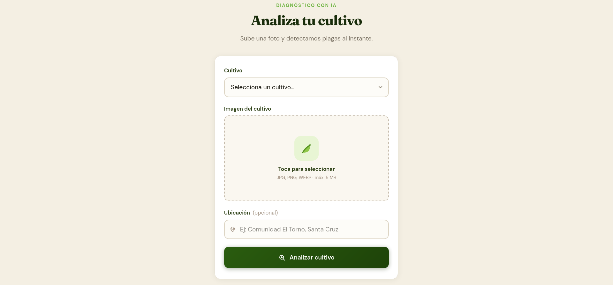
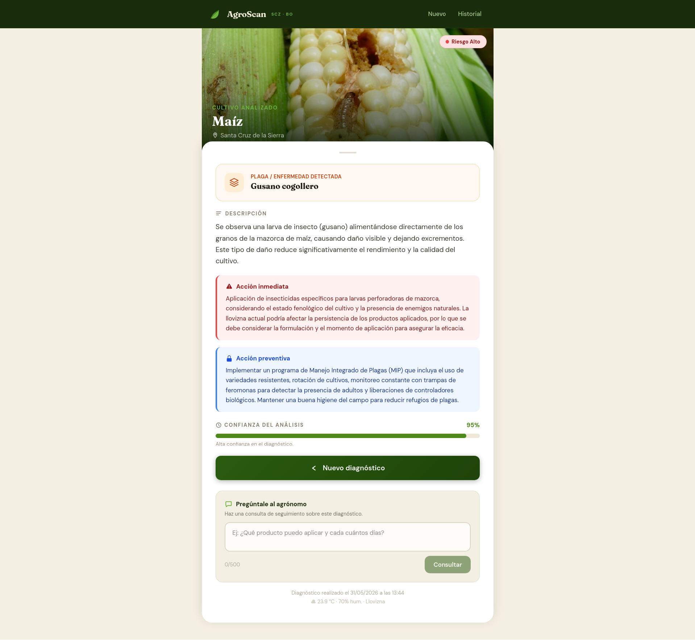
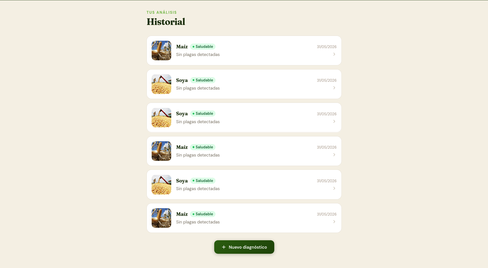

<p align="center">
  <h1 align="center">AgroScan 🌱</h1>
  <p align="center"><em>Diagnóstico inteligente de plagas para pequeños productores de Santa Cruz, Bolivia.</em></p>
</p>

AgroScan es una aplicación web que permite a agricultores subir una fotografía de su cultivo y recibir en segundos un diagnóstico de plagas o enfermedades impulsado por inteligencia artificial, junto con acciones inmediatas y preventivas adaptadas al contexto agrícola de Santa Cruz, Bolivia.

<p align="center">
  Desarrollado para el hackathon <strong>Build With AI 2026</strong> organizado por <strong>GDG Santa Cruz</strong> y la <strong>Universidad Católica Boliviana (UCB)</strong>.
</p>

---

## Equipo

| Nombre                    | GitHub                                     |
| ------------------------- | ------------------------------------------ |
| José Andrés Meneces López | [@Jandres25](https://github.com/Jandres25) |
| José María Orozco Sossa   | [@Jhos3ph](https://github.com/Jhos3ph)     |

Contacto: jandrespb4@gmail.com

---

## Capturas de pantalla

### Formulario de diagnóstico

Selección de cultivo, carga de imagen con vista previa y ubicación opcional.



---

### Resultado del diagnóstico

Plaga detectada, nivel de riesgo, acciones recomendadas y condiciones climáticas actuales.



---

### Historial de diagnósticos

Lista paginada de todos los análisis realizados con badge de riesgo y fecha.



---

## Arquitectura

```
agroscan/
├── app/
│   ├── Http/Controllers/
│   │   └── DiagnosisController.php   ← create, store, show, index, consulta
│   ├── Http/Requests/
│   │   └── DiagnosisFormRequest.php
│   ├── Models/
│   │   └── Diagnosis.php
│   └── Services/
│       ├── GeminiService.php         ← Vertex AI (Gemini Vision)
│       └── WeatherService.php        ← Open-Meteo API
├── config/
│   └── gemini.php
├── database/migrations/
│   └── ..._create_diagnoses_table.php
├── resources/views/diagnosis/
│   ├── create.blade.php              ← formulario de carga
│   ├── show.blade.php                ← resultado + chat de consultas
│   └── index.blade.php              ← historial paginado
└── routes/web.php
```

**Flujo principal:**

1. El agricultor selecciona el cultivo, sube una foto y opcionalmente indica su ubicación.
2. `WeatherService` resuelve las coordenadas exactas según la ubicación (25 municipios de SCZ reconocidos) y consulta Open-Meteo para obtener temperatura, humedad y condición del cielo en tiempo real.
3. `GeminiService` envía la imagen junto con el contexto climático y la ubicación a Gemini Vision API, que devuelve un JSON estructurado con plaga detectada, nivel de riesgo y acciones adaptadas al clima actual.
4. El resultado se persiste en base de datos y se muestra al agricultor con un chat de consultas de seguimiento impulsado por el mismo modelo.

---

## Stack tecnológico

| Tecnología        | Versión          | Rol                                    |
| ----------------- | ---------------- | -------------------------------------- |
| PHP               | 8.2+             | Lenguaje backend                       |
| Laravel           | 12.x             | Framework principal                    |
| MariaDB           | 10.x+            | Base de datos (producción y dev local) |
| SQLite            | —                | Base de datos en tests                 |
| Gemini Vision API | gemini-2.0-flash | Análisis de imagen con IA (Vertex AI)  |
| Open-Meteo API    | —                | Condiciones climáticas (sin clave)     |
| Alpine.js         | 3.15.x           | Interactividad frontend                |
| Tailwind CSS      | 4.x              | Estilos utilitarios                    |
| Vite              | 7.x              | Bundler de assets                      |

---

## Requisitos previos

- PHP 8.2+
- Composer
- Node.js 18+ y npm
- MariaDB o MySQL corriendo localmente (XAMPP, Laragon, etc.)
- Cuenta de Google Cloud con Vertex AI habilitado y credenciales de aplicación configuradas (`GOOGLE_APPLICATION_CREDENTIALS`)

---

## Instalación y ejecución

```bash
# 1. Clonar el repositorio
git clone https://github.com/Jandres25/agroscan.git
cd agroscan

# 2. Instalar dependencias PHP
composer install

# 3. Instalar dependencias JS
npm install

# 4. Copiar y configurar variables de entorno
cp .env.example .env
php artisan key:generate

# 5. Configurar la base de datos en .env (ver sección siguiente)
# 6. Ejecutar migraciones
php artisan migrate

# 7. Crear el enlace simbólico para imágenes públicas
php artisan storage:link

# 8. Compilar assets
npm run build

# 9. Iniciar el servidor de desarrollo
php artisan serve
```

La aplicación estará disponible en `http://localhost:8000`.

---

## Variables de entorno requeridas

Copia `.env.example` a `.env` y completa los siguientes valores:

```env
# Base de datos
DB_CONNECTION=mysql
DB_HOST=127.0.0.1
DB_PORT=3306
DB_DATABASE=agroscan
DB_USERNAME=root
DB_PASSWORD=

# Google Cloud / Vertex AI
GOOGLE_CLOUD_PROJECT=tu-project-id
GOOGLE_APPLICATION_CREDENTIALS=/ruta/a/credentials.json

# Gemini (opcional — usa los valores por defecto si no se especifican)
GEMINI_MODEL=gemini-2.0-flash
GEMINI_LOCATION=us-central1
GEMINI_TIMEOUT=30
```

> **Nunca** commitear el archivo `.env` ni las credenciales de Google Cloud al repositorio.

---

## Ejecución de tests

```bash
composer run test
# o directamente:
php artisan test
```

Los tests usan SQLite en memoria — no requieren MariaDB corriendo.

---

## Plagas objetivo (Santa Cruz, Bolivia)

| Plaga            | Cultivos típicos  |
| ---------------- | ----------------- |
| Gusano cogollero | Maíz, sorgo       |
| Nematodos        | Soya, hortalizas  |
| Bacteriosis      | Arroz, tomate     |
| Monilia          | Cacao             |
| Roya             | Soya, café, trigo |

---

## Licencia

MIT

---

<p align="center">
  Hecho con ❤️ en Santa Cruz, Bolivia · <strong>Build With AI 2026</strong> · GDG Santa Cruz · UCB
</p>
